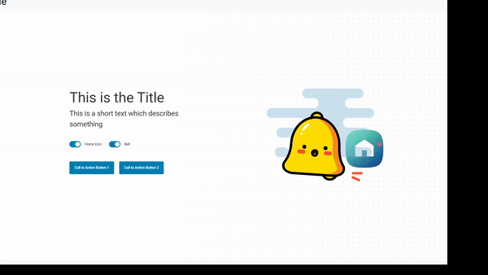

# volto-download-block

The Volto block offers a solution for adding animated SVGs as layers on top of each
other to give your frontpage a unique look. You have the flexibility to either utilize
external SVGs or create your own animated SVGs, for instance, with the help of SVGator.

If you prefer to use your own uploaded Plone File SVGs, you'll need to install
the addon "interaktiv.volto_animated_layers_block" for the integration to work.

## Build on

## Preview

